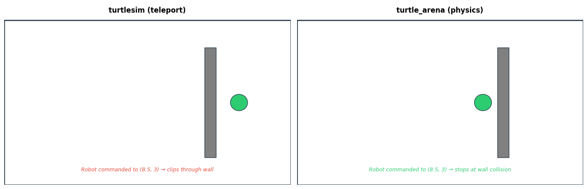
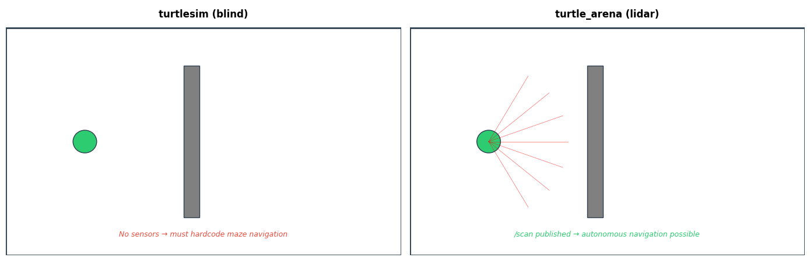
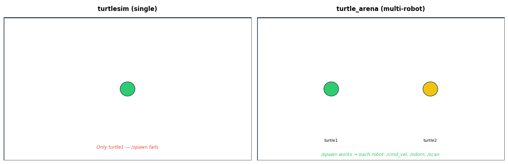

# turtle_arena — A ROS2 Simulator for the Modern Era

`turtle_arena` is a **turtlesim successor** with real physics, sensors, and challenge worlds. It's designed for learning ROS2 robotics: start with simple keyboard control, then graduate to sensor-driven autonomy in maze environments.

## Why? (vs. turtlesim)

### 1. **Real Physics, Not Teleportation**



**turtlesim**: Robots teleport anywhere on the map, passing through walls like ghosts.  
**turtle_arena**: Box2D-powered 2D physics — robots collide realistically with walls and each other.

*Use case*: Learn collision handling, path planning around obstacles, and realistic dynamics.

### 2. **Sensors for Autonomous Navigation**



**turtlesim**: No built-in sensors — you either hardcode the maze or publish your own fake `/scan`.  
**turtle_arena**: Every robot gets a simulated lidar publishing `sensor_msgs/LaserScan` via raycasting against the world geometry.

*Use case*: Practice SLAM, navigation stacks (Nav2), and sensor-fusion algorithms without a real robot or Gazebo.

### 3. **Multi-Robot Support Out of the Box**



**turtlesim**: Single `turtle1` — `/spawn` is a no-op.  
**turtle_arena**: Unlimited robots. Each gets independent `/cmd_vel`, `/odom`, `/pose`, `/scan`, `/challenge_status` namespaced topics.

*Use case*: Teach multi-agent coordination, swarm algorithms, or just chaos (robots colliding is fun).

### 4. **Game-Like Challenges**

**turtlesim**: Open square. Navigate or publish random velocities; no goal.  
**turtle_arena**: Three shipped worlds (empty arena, zigzag maze, obstacle slalom) with **goal zones** and **collision tracking**.

*Use case*: Gamify learning. "Navigate this maze using only `/scan`" is a better learning hook than "move the turtle."

---

## Quick Start

### 1. **Interactive Mode** (Keyboard Control)

```bash
cd ~/claude/ros2
. /opt/ros/humble/setup.bash && . install/setup.bash
./install/turtle_arena/lib/turtle_arena/turtle_arena_node
```

Drive with:
- **Up/W** = forward
- **Down/S** = backward
- **Left/A** = turn left
- **Right/D** = turn right

### 2. **ROS2 Control** (Topic-Based)

Terminal 1:
```bash
./install/turtle_arena/lib/turtle_arena/turtle_arena_node
```

Terminal 2 — Drive forward:
```bash
. /opt/ros/humble/setup.bash && . install/setup.bash
ros2 topic pub /turtle1/cmd_vel geometry_msgs/msg/Twist "{linear: {x: 1.0}}" --rate 10
```

Terminal 3 — Watch odometry:
```bash
ros2 topic echo /turtle1/odom
```

### 3. **Challenge Worlds**

Navigate the maze using only lidar:

```bash
./install/turtle_arena/lib/turtle_arena/turtle_arena_node \
  --ros-args -p world_file:=install/turtle_arena/share/turtle_arena/worlds/simple_maze.yaml
```

Then:
```bash
# Publish a velocity command
ros2 topic pub /turtle1/cmd_vel geometry_msgs/msg/Twist "{linear: {x: 0.5}}" --rate 10

# Watch the challenge status
ros2 topic echo /turtle1/challenge_status
```

When you reach the yellow goal zone, it reports `status=success`.

### 4. **Multi-Robot**

```bash
# Terminal 1: Start simulator
./install/turtle_arena/lib/turtle_arena/turtle_arena_node

# Terminal 2: Spawn a second robot
ros2 service call /spawn turtlesim/srv/Spawn "{x: 3.0, y: 3.0, theta: 0.0, name: 'turtle2'}"

# Terminal 3: Drive turtle2 independently
ros2 topic pub /turtle2/cmd_vel geometry_msgs/msg/Twist "{linear: {x: 1.0}}" --rate 10

# Both robots render in the same window with independent physics
```

---

## Architecture

### Core Components

| Component | Purpose |
|-----------|---------|
| **ArenaWorld** (Box2D) | Physics simulation, collision detection, obstacle walls |
| **Renderer** (SFML) | Real-time 2D visualization of arena, robots, zones |
| **RobotEntity** | Per-robot ROS2 interface (subscription, publications) |
| **LidarSensor** | Raycast-based `/scan` generation per robot |
| **ChallengeManager** | Goal detection, collision counting, elapsed time tracking |
| **ArenaNode** | Lifecycle node orchestrating the above; `/spawn`, `/kill`, `/world/reset` services |

### Shipped Worlds

| World | Description | Best For |
|-------|-------------|----------|
| `empty_arena.yaml` | Open space, start/goal zones | Learning ROS2 basics without obstacles |
| `simple_maze.yaml` | Zigzag corridor (3 walls) | Corridor-following, wall avoidance |
| `obstacle_slalom.yaml` | Three pillars in a row | Slalom / weaving behavior |

Define your own by editing the YAML schema (see `worlds/*.yaml`).

---

## Published Topics & Services

### Per-Robot Topics

For a robot named `<name>` (e.g., `turtle1`):

| Topic | Type | Purpose |
|-------|------|---------|
| `<name>/cmd_vel` | `geometry_msgs/Twist` | **Input**: linear.x and angular.z velocity commands |
| `<name>/odom` | `nav_msgs/Odometry` | **Output**: position, velocity, and orientation from Box2D |
| `<name>/pose` | `turtlesim/Pose` | **Output**: turtlesim-compatible pose (for existing scripts) |
| `<name>/scan` | `sensor_msgs/LaserScan` | **Output**: 360-ray lidar scan at 0.1m resolution |
| `<name>/challenge_status` | `std_msgs/String` | **Output**: `status=success/in_progress elapsed=<seconds> collisions=<count>` |

### Global Services

| Service | Type | Purpose |
|---------|------|---------|
| `/spawn` | `turtlesim/Spawn` | Spawn a new robot at (x, y, theta) with optional name |
| `/kill` | `turtlesim/Kill` | Remove a robot by name |
| `/world/reset` | `std_srvs/Trigger` | Teleport all robots to start zone, reset collision counts |

---

## Installation & Build

### Prerequisites

```bash
. /opt/ros/humble/setup.bash
sudo apt-get install -y libsfml-dev libyaml-cpp-dev
```

### Build

```bash
cd ~/claude/ros2
colcon build --packages-select turtle_arena
```

Includes:
- **Box2D** (vendored via CMake FetchContent for deterministic builds)
- **SFML** (linked from system libsfml-dev)
- **yaml-cpp** (linked from system libyaml-cpp-dev)

### Run Tests

```bash
colcon test --packages-select turtle_arena
```

Includes unit/integration tests. Launch test (`test_cmd_vel_to_odom.py`) verifies physics/ROS2 wiring without needing a display.

---

## Configuration

### Headless Mode (for CI/testing without DISPLAY)

```bash
./install/turtle_arena/lib/turtle_arena/turtle_arena_node --ros-args -p headless:=true
```

Uses a wall timer instead of SFML's event loop — node still publishes all topics/services, no window rendered.

### Custom World

```bash
./install/turtle_arena/lib/turtle_arena/turtle_arena_node \
  --ros-args -p world_file:=/path/to/my_world.yaml
```

If `world_file` is empty (default), loads a simple 10m×7.5m arena with no obstacles.

---

## Design Goals

1. **turtlesim compatibility**: Drop-in replacement. `/spawn`, `/kill`, `/cmd_vel`, `/odom` work identically so existing tutorials/scripts work unmodified.
2. **Educational**: Clear progression from "move a turtle" → "navigate a maze using only sensors" → "coordinate multiple robots."
3. **Realistic**: Real physics (collisions, momentum) + simulated sensors (lidar) so the leap to real robots feels natural.
4. **Low friction**: No Gazebo overhead, no Docker, native SFML rendering. Builds and runs in seconds.

---

## Examples

### Navigate a Maze (Autonomous)

Write a simple nav script:

```python
import rclpy
from nav_msgs.msg import Odometry
from geometry_msgs.msg import Twist
from sensor_msgs.msg import LaserScan

rclpy.init()
node = rclpy.create_node('maze_navigator')

def on_scan(msg):
    # Obstacle at 0° (ahead)? Turn left.
    # Otherwise move forward.
    twist = Twist()
    if msg.ranges[len(msg.ranges) // 2] < 1.0:
        twist.angular.z = 1.0
    else:
        twist.linear.x = 0.5
    cmd_pub.publish(twist)

node.create_subscription(LaserScan, '/turtle1/scan', on_scan, 10)
cmd_pub = node.create_publisher(Twist, '/turtle1/cmd_vel', 10)

rclpy.spin(node)
```

Then:

```bash
# Terminal 1: Start simulator with a maze
./install/turtle_arena/lib/turtle_arena/turtle_arena_node \
  --ros-args -p world_file:=.../worlds/simple_maze.yaml

# Terminal 2: Run your navigator
python3 maze_navigator.py
```

Watch it navigate!

### Multi-Robot Coordination

```bash
# Terminal 1: Start simulator
./install/turtle_arena/lib/turtle_arena/turtle_arena_node

# Terminal 2: Spawn 3 robots
ros2 service call /spawn turtlesim/srv/Spawn "{x: 1, y: 1, name: 'robot1'}"
ros2 service call /spawn turtlesim/srv/Spawn "{x: 5, y: 5, name: 'robot2'}"
ros2 service call /spawn turtlesim/srv/Spawn "{x: 9, y: 1, name: 'robot3'}"

# Terminal 3-5: Drive each robot independently
for i in 1 2 3; do
  ros2 topic pub /robot$i/cmd_vel geometry_msgs/msg/Twist "{linear: {x: 0.5}}" --rate 10 &
done
```

---

## FAQ

**Q: Can I use this with Nav2?**  
A: Yes. `turtle_arena` publishes `/scan` and `/odom` — point Nav2 at it and add a costmap + planner.

**Q: How does it compare to Gazebo?**  
A: Gazebo is photorealistic and physics-heavy; turtle_arena is lightweight and focused on ROS2 learning. Pick Gazebo if you need 3D, pick turtle_arena if you want fast iteration on 2D concepts.

**Q: Can I modify the worlds?**  
A: Yes. Edit `worlds/*.yaml` or create new ones. YAML schema:
```yaml
name: my_world
dimensions: {width: 10.0, height: 7.5}
walls:
  - {cx: 5.0, cy: 3.0, hx: 0.5, hy: 1.0}  # center, half-extents
start_zone: {x: 1.0, y: 1.0, radius: 0.5}
goal_zone: {x: 9.0, y: 7.0, radius: 0.5}
```

**Q: I got permission denied pushing to GitHub. What do I do?**  
A: Use SSH (`git@github.com:...`) instead of HTTPS. Or generate a personal access token at https://github.com/settings/tokens and use it as your password.

---

## Development & Testing

Generate the comparison diagrams:

```bash
python3 tools/anim/gen_comparison_gifs.py
```

The script lives in `tools/anim/` alongside the example YAML world generator and other utilities.

---

## License

MIT

---

## Author

Vikas Chauhan (vikaschauhan309@gmail.com)  
Built as a modern, physics-aware successor to ROS2's `turtlesim`.
